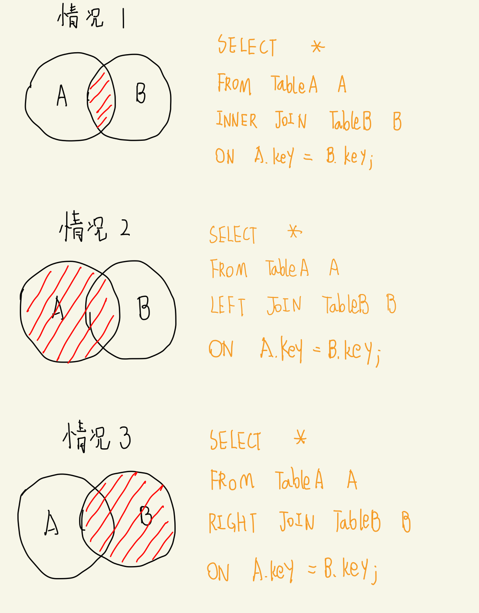
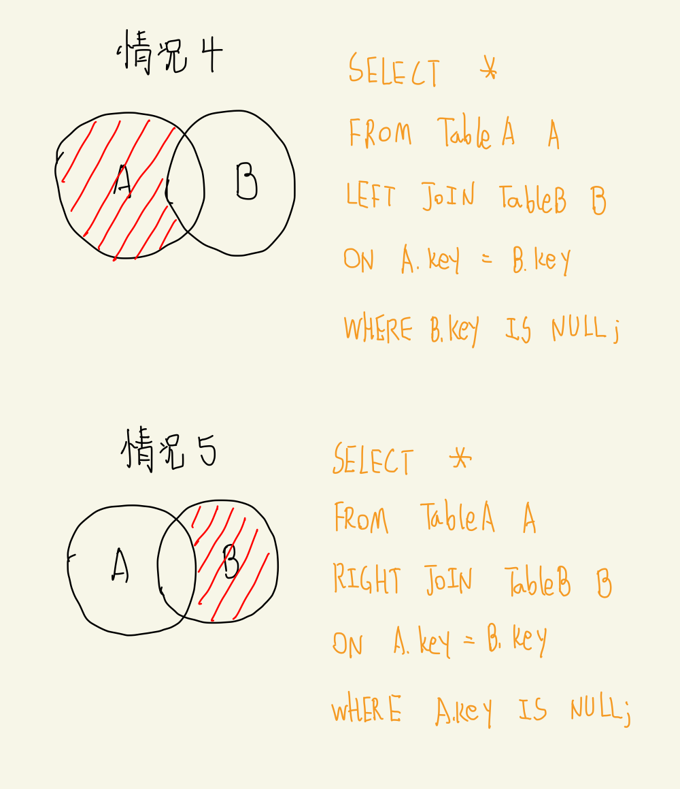
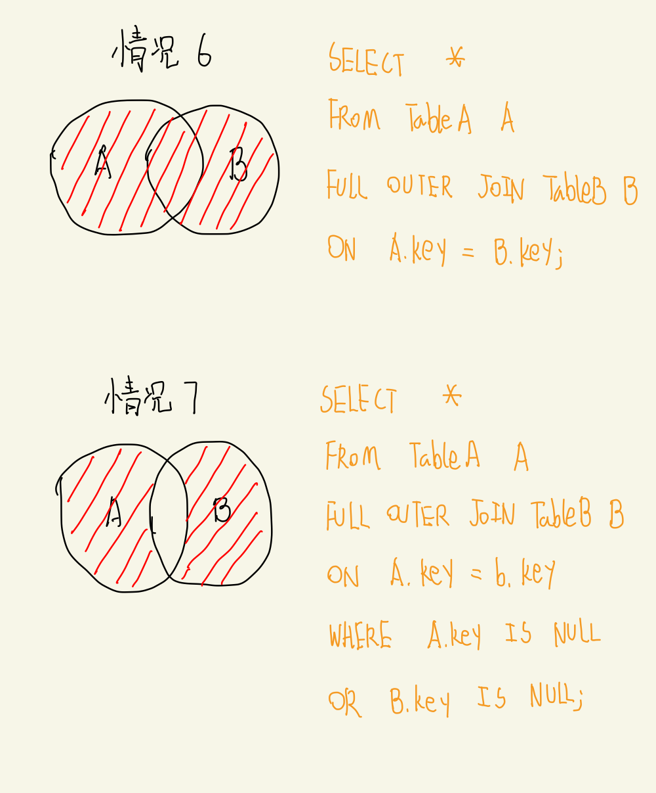
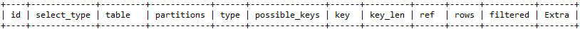

## MySQL 高级

### 一、MySQL 简介

#### 1. 软件安装

- 安装 MySQL 服务端

  ```bash
  rpm -ivh mysql-server-xxx.rpm
  ```

- 安装 MySQL 客户端

  ```bash
  rpm -ivh mysql-client-xxx.rpm
  ```

- 开机自启 MySQL 服务

  ```bash
  方式一:
      chkconfig mysql on
      chkconfig --list | grep -i mysql
  方式二:
      ntsysv
  ```

- 启动/停止/重启 MySQL 服务

  ```bash
  service start/stop/restart mysql
  ```

- 连接 MySQL 服务端

  ```bash
  mysql -hlocalhost -P3306 -uroot -p
  ```

- 检查 MySQL 设置的字符集（可以修改配置文件使其永久生效）

  ```mysql
  SHOW VARIABLES LIKE '%character%';
  ```

#### 2. MySQL 架构

- 连接层
- 服务层
- 引擎层
- 存储层

#### 3. MySQL 存储引擎

- 查看当前数据库支持的存储引擎

  ```mysql
  SHOW ENGINES;
  ```

- 查看默认存储引擎

  ```mysql
  SHOW VARIABLES LIKE '%default_storage_engine%';
  ```
- 存储引擎 MyISAM 和 InnoDB 的对比 

|  对比项  |                          MyISAM                          |                            InnoDB                            |
| :------: | :------------------------------------------------------: | :----------------------------------------------------------: |
|  主外键  |                          不支持                          |                             支持                             |
|   事务   |                          不支持                          |                             支持                             |
|  行表锁  | 表锁，即使操作一条记录也会锁住整个表，不适合高并发的操作 | 行锁，操作时只锁住某一行，不对其它行有影响，适合高并发的操作 |
|   缓存   |               只是缓存索引，不缓存真实数据               | 不仅缓存索引还有缓存真实数据，对内存要求较高，而且内存大小对性能有决定性的影响 |
|  表空间  |                            小                            |                              大                              |
|  关注点  |                           性能                           |                             事务                             |
| 默认安装 |                            Y                             |                              Y                               |

### 二、MySQL 优化分析

#### 1. JOIN 语句的 7 种类型

```mysql
1. SELECT * FROM TableA A INNER JOIN TableB B ON A.key = B.key;
2. SELECT * FROM TableA A LEFT JOIN TableB B ON A.key = B.key;
3. SELECT * FROM TableA A RIGHT JOIN TableB B ON A.key = B.key;
4. SELECT * FROM TableA A LEFT JOIN TableB B ON A.key = B.key WHERE B.key IS NULL;
5. SELECT * FROM TableA A RIGHT JOIN TableB B ON A.key = B.key WHERE A.key IS NULL;
6. SELECT * FROM TableA A FULL OUTER JOIN TableB B ON A.key = B.key;
7. SELECT * FROM TableA A FULL OUTER JOIN TableB B ON A.key = B.key WHERE A.key IS NULL OR B.key IS NULL;
```

#### 2. 数据准备

```mysql
DROP DATABASE IF EXISTS `o7si_join_test`;
CREATE DATABASE `o7si_join_test`;

USE `o7si_join_test`;

CREATE TABLE `tbl_dept`(
	`id` INT NOT NULL AUTO_INCREMENT,
	`deptName` VARCHAR(20) DEFAULT NULL,
	PRIMARY KEY(`id`)
) ENGINE=INNODB AUTO_INCREMENT=1 DEFAULT CHARSET=utf8;

CREATE TABLE `tbl_emp`(
	`id` INT NOT NULL AUTO_INCREMENT,
	`name` VARCHAR(20) DEFAULT NULL,
	`deptId` INT DEFAULT NULL,
	PRIMARY KEY(`id`)
) ENGINE=INNODB AUTO_INCREMENT=1 DEFAULT CHARSET=utf8;

INSERT INTO tbl_dept VALUES(DEFAULT, 'RD');
INSERT INTO tbl_dept VALUES(DEFAULT, 'HR');
INSERT INTO tbl_dept VALUES(DEFAULT, 'MK');
INSERT INTO tbl_dept VALUES(DEFAULT, 'MIS');
INSERT INTO tbl_dept VALUES(DEFAULT, 'FD');

INSERT INTO tbl_emp(`name`, `deptId`) VALUES('test-1', 1); 
INSERT INTO tbl_emp(`name`, `deptId`) VALUES('test-2', 1); 
INSERT INTO tbl_emp(`name`, `deptId`) VALUES('test-3', 1); 
INSERT INTO tbl_emp(`name`, `deptId`) VALUES('test-4', 2); 
INSERT INTO tbl_emp(`name`, `deptId`) VALUES('test-5', 2); 
INSERT INTO tbl_emp(`name`, `deptId`) VALUES('test-6', 3); 
INSERT INTO tbl_emp(`name`, `deptId`) VALUES('test-7', 4);
INSERT INTO tbl_emp(`name`, `deptId`) VALUES('test-8', 10);
```

#### 3. 使用 JOIN 语句

```mysql
SELECT * FROM tbl_emp a INNER JOIN tbl_dept b ON a.deptId = b.id;
+----+--------+--------+----+----------+
| id | name   | deptId | id | deptName |
+----+--------+--------+----+----------+
|  1 | test-1 |      1 |  1 | RD       |
|  2 | test-2 |      1 |  1 | RD       |
|  3 | test-3 |      1 |  1 | RD       |
|  4 | test-4 |      2 |  2 | HR       |
|  5 | test-5 |      2 |  2 | HR       |
|  6 | test-6 |      3 |  3 | MK       |
|  7 | test-7 |      4 |  4 | MIS      |
+----+--------+--------+----+----------+
7 rows in set
```

```mysql
SELECT * FROM tbl_emp a LEFT JOIN tbl_dept b ON a.deptId = b.id;
+----+--------+--------+------+----------+
| id | name   | deptId | id   | deptName |
+----+--------+--------+------+----------+
|  1 | test-1 |      1 |    1 | RD       |
|  2 | test-2 |      1 |    1 | RD       |
|  3 | test-3 |      1 |    1 | RD       |
|  4 | test-4 |      2 |    2 | HR       |
|  5 | test-5 |      2 |    2 | HR       |
|  6 | test-6 |      3 |    3 | MK       |
|  7 | test-7 |      4 |    4 | MIS      |
|  8 | test-8 |     10 | NULL | NULL     |
+----+--------+--------+------+----------+
8 rows in set
```

```mysql
SELECT * FROM tbl_emp a RIGHT JOIN tbl_dept b ON a.deptId = b.id;
+------+--------+--------+----+----------+
| id   | name   | deptId | id | deptName |
+------+--------+--------+----+----------+
|    1 | test-1 |      1 |  1 | RD       |
|    2 | test-2 |      1 |  1 | RD       |
|    3 | test-3 |      1 |  1 | RD       |
|    4 | test-4 |      2 |  2 | HR       |
|    5 | test-5 |      2 |  2 | HR       |
|    6 | test-6 |      3 |  3 | MK       |
|    7 | test-7 |      4 |  4 | MIS      |
| NULL | NULL   | NULL   |  5 | FD       |
+------+--------+--------+----+----------+
8 rows in set
```

```mysql
SELECT * FROM tbl_emp a LEFT JOIN tbl_dept b ON a.deptId = b.id WHERE b.id IS NULL;
+----+--------+--------+------+----------+
| id | name   | deptId | id   | deptName |
+----+--------+--------+------+----------+
|  8 | test-8 |     10 | NULL | NULL     |
+----+--------+--------+------+----------+
1 row in set
```

```mysql
SELECT * FROM tbl_emp a RIGHT JOIN tbl_dept b ON a.deptId = b.id WHERE a.deptId IS NULL;
+------+------+--------+----+----------+
| id   | name | deptId | id | deptName |
+------+------+--------+----+----------+
| NULL | NULL | NULL   |  5 | FD       |
+------+------+--------+----+----------+
1 row in set
```

```mysql
# MySQL：不支持所谓的全外连接，故用以下语句替代
SELECT * FROM tbl_emp a LEFT JOIN tbl_dept b ON a.deptId = b.id
UNION
SELECT * FROM tbl_emp a RIGHT JOIN tbl_dept b ON a.deptId = b.id;
+------+--------+--------+------+----------+
| id   | name   | deptId | id   | deptName |
+------+--------+--------+------+----------+
|    1 | test-1 |      1 |    1 | RD       |
|    2 | test-2 |      1 |    1 | RD       |
|    3 | test-3 |      1 |    1 | RD       |
|    4 | test-4 |      2 |    2 | HR       |
|    5 | test-5 |      2 |    2 | HR       |
|    6 | test-6 |      3 |    3 | MK       |
|    7 | test-7 |      4 |    4 | MIS      |
|    8 | test-8 |     10 | NULL | NULL     |
| NULL | NULL   | NULL   |    5 | FD       |
+------+--------+--------+------+----------+
9 rows in set
```

```mysql
# MySQL：不支持所谓的全外连接，故用以下语句替代
SELECT * FROM tbl_emp a LEFT JOIN tbl_dept b ON a.deptId = b.id WHERE b.id IS NULL
UNION
SELECT * FROM tbl_emp a RIGHT JOIN tbl_dept b ON a.deptId = b.id WHERE a.deptId IS NULL;
+------+--------+--------+------+----------+
| id   | name   | deptId | id   | deptName |
+------+--------+--------+------+----------+
|    8 | test-8 |     10 | NULL | NULL     |
| NULL | NULL   | NULL   |    5 | FD       |
+------+--------+--------+------+----------+
2 rows in set
```

#### 4. 总结







### 三、索引

#### 1. 什么是索引？

> 索引（Index）是帮助 MySQL 高效获取数据的数据结构。

- 数据本身之外，数据库还维护着一个满足特定查找算法的数据结构，这些数据结构以某种方式指向数据，这样就可以在这些数据结构的基础上实现高级查找算法，这种数据结构就是索引。
- 一般来说索引本身也很大，不可能全部存储在内存种，因此索引往往以索引文件的形式存储在磁盘上。
- 平时所说的索引，如果没有特别指明，都是指 B 树结构组织的索引。其中聚集索引、次要索引、覆盖索引、复合索引、前缀索引、唯一索引默认都是使用 B+ 树索引，统称索引。当然，除了 B+ 树这种类型的索引之外，还有哈希索引等。

#### 2. 索引的优势

- 类似图书馆建立书目索引，提高数据检索的效率，降低数据库的 IO 成本。
- 通过索引列对数据进行排序，降低数据排序的成本，降低了 CPU 的消耗。

#### 3. 索引的劣势

+ 实际上索引也是一张表，该表保存了主键与索引字段，并指向实体表的记录，所以索引列也需要占用空间。
+ 虽然索引大大提高了查询速度，同时却会降低更新表的速度，如对表进行 INSERT/UPDATE/DELETE 等。由于更新表时， MySQL 不仅要保存数据，还要更新相关字段的索引，所以更新速度会降低。
+ 索引只是提高效率的一个因素，如果 MySQL 中有大数据量的表，就需要花时间研究如何建立最优秀的索引或优化查询语句。

#### 4. 索引的分类

- 单值索引：即一个索引只包含单个列，一个表可以有多个单列索引。
- 唯一索引：索引列的值必须唯一，但允许有空值。
- 复合索引：即一个索引包含多个列。

#### 5. 索引结构

- BTree 索引
- Hash 索引
- FullText 索引
- RTree 索引

#### 6. 哪些情况需要创建索引？

1. 主键自动建立唯一索引。
2. 频繁作为查询条件的字段应该创建索引。
3. 查询中与其它表关联的字段，如外键关系应该建立索引。
4. 频繁更新的字段不适合建立索引。
5. WHERE 条件中用不到的字段不建立索引。
6. 单值索引？组合索引？（高并发场景下倾向于创建组合索引）
7. 查询中排序的字段，排序字段若通过索引去访问将大大提高排序速度。
8. 查询中统计或分组字段。

#### 7. 哪些情况不要创建索引？

1. 表记录过少。
2. 经常进行更新的表。
3. 如果某个数据列包含大量重复的内容，为它建立索引就没有太大的实际效果。

### 四、性能分析

#### 1. MySQL Query Optimizer

#### 2. MySQL 常见瓶颈

- CPU：CPU 饱和（一般发生在数据装入内存或从磁盘上读取数据的时候）。
- IO：磁盘 I/O瓶颈（发生在装入数据远大于内存容量的时候）。
- 服务器硬件的性能瓶颈：使用 top/free/iostat/vmstat 等命令查看系统的性能状态。

#### 3. Explain

- 使用：EXPLAIN + SQL 语句

  

- 表的读取顺序（id）
  
  - id 越大越先被读取，id 相同由上至下进行读取。
- 数据读取操作的操作类型（select_type）
  - SIMPLE：简单的 SELECT 查询，查询中不包含子查询或 UNION。
  - PRIMARY：查询中若包含任何复杂的子查询，最外层查询则被标记为 PRIMARY。
  - SUBQUERY：在 SELECT 或 WHERE 列表中包含的子查询。
  - DERIVED：在 FROM 列表中包含的子查询被标记为 DERIVED（衍生），MySQL 会递归执行这些子查询，将结果放入临时表中。
  - UNION：若 SELECT 出现在 UNION 之后，则被标记为 UNION；若 UNION 包含在 FROM 子句的子查询中，外层将被标记为 DERIVED。
  - UNION RESULT：从 UNION 表获取结果的 SELECT。

- 表（table）

  - 数据是关于哪一张表的。

- 访问类型（type）

  - system > const > eq_ref > ref > range > index > ALL
  - 一般来说，查询至少应该达到 range 级别，最好能达到 ref 级别。
    - system：表中只有一行记录（相当于系统表），平时不会出现，可以忽略。
    - const：表示通过索引一次变找到了结果，const 用于比较 primary key 或者 unique 索引。由于只匹配一行数据，所以效率很高，如将主键置于 where 列表中，MySQL 就能将该查询转换为一个常量。
    - eq_ref：唯一性索引扫描，对于每个索引键，表中只有一条记录与之匹配，常见于主键或唯一索引扫描。
    - ref：非唯一性索引扫描，返回匹配某个单独值的所有行。
    - range：只检索给定范围的行，使用一个索引来选择行，在 where 中出现了 between、<、>、in 等的查询。这种范围扫描索引比全表扫描要好，因为它只需要开始索引于某一点，结束索引于另一点，不用扫描全部索引。
    - index：Full Index Scan，index 于 ALL 区别为 index 类似只遍历索引树，这通常比 ALL 效率高，因为索引文件通常比数据文件小（虽然 ALL 和 index 都是读全表，但 index 是从索引中读取的，而 ALL 是从硬盘中读取的）。
    - ALL：Full Table Scan，将遍历全表以找到匹配的行。

- possible_keys

  - 显示可能应用在这张表中的索引，一个或多个。查询涉及到的字段若存在索引，则该索引被列出，但不一定被查询实际使用。

- key

  - 实际使用的索引，如果为 NULL，则表示没有使用索引。查询中若使用了覆盖索引，则该索引仅出现在 key 列表中。

- key_len

  - 表示索引中使用的字节数，可通过该列计算查询中使用的索引的长度，在不损失精确性的情况下，长度越短越好。key_len 显示的值为索引字段的最大可能长度，并非实际使用长度，即 key_len 是根据表定义计算而得，不是通过表内检索出的。

- ref

  - 显示索引的哪一列被使用了，如果可能的话，是一个常数。哪些列或常量被用于查找索引列上的值。

- rows

  - 根据表统计信息及索引选用情况，大致估算找到所需的记录所需要读取的行数。

- Extra

  - 包含不适合在其它列中显示但十分重要的额外信息。

    - Using filesort：说明 MySQL 会对数据使用一个外部的索引排序，而不是按照表内的索引排序顺序进行读取。MySQL 中无法利用索引完成的排序操作称为“文件排序”。

    - Using temporary：使用了临时表保存中间结果，MySQL 在对查询结果排序时使用临时表。常见于 ordey by 和 group by。

    - Using index

      - 表示相应的 select 操作使用了覆盖索引，避免访问了表的数据行，效率高。
      - 如果同时出现 Using where，表明索引被用来执行索引键值的查找。
      - 如果没有同时出现 Using where，表明索引用来读取数据而非执行查找动作。

    - Using where：表明使用了 where 过滤。

    - Using join buffer：表明使用了连接缓存。

    - Impossible where：where 子句的值总是 false，不能用来获取任何元组。

    - Select tables optimized away：略。

    - Distinct：优化 distinct 操作，在找到第一个匹配的元组后即停止相同值的查找动作。

### 五、索引优化

#### 1. 索引分析

-  单表

  - 数据准备

    ```mysql
    CREATE TABLE IF NOT EXISTS `article`(
    	`id` INT UNSIGNED NOT NULL PRIMARY KEY AUTO_INCREMENT,
    	`author_id` INT UNSIGNED NOT NULL,
    	`category_id` INT UNSIGNED NOT NULL,
    	`views` INT UNSIGNED NOT NULL,
    	`comments` INT UNSIGNED NOT NULL,
    	`title` VARBINARY(255) NOT NULL,
    	`content` TEXT NOT NULL
    );
    
    INSERT INTO `article`(`author_id`, `category_id`, `views`, `comments`, `title`, `content`) 
    VALUES
    (1, 1, 1, 1, '1', '1'),
    (2, 2, 2, 2, '2', '2'),
    (1, 1, 3, 3, '3', '3');
    ```

  - 具体分析：略。

- 两表

  - 数据准备

    ```mysql
    CREATE TABLE IF NOT EXISTS `class`(
    	`id` INT UNSIGNED NOT NULL AUTO_INCREMENT,
    	`card` INT UNSIGNED NOT NULL,
    	PRIMARY KEY(`id`)
    );
    
    CREATE TABLE IF NOT EXISTS `book`(
    	`bookid` INT UNSIGNED NOT NULL AUTO_INCREMENT,
    	`card` INT UNSIGNED NOT NULL,
    	PRIMARY KEY(`bookid`)
    );
    
    # 执行 20 次
    INSERT INTO `class`(`card`) VALUES(FLOOR(1 + RAND() * 20));
    # 执行 20 次
    INSERT INTO `book`(`card`) VALUES(FLOOR(1 + RAND() * 20));
    ```

  - 具体分析：略。

- 三表

  - 数据准备

    ```mysql
    CREATE TABLE IF NOT EXISTS `class`(
    	`id` INT UNSIGNED NOT NULL AUTO_INCREMENT,
    	`card` INT UNSIGNED NOT NULL,
    	PRIMARY KEY(`id`)
    );
    
    CREATE TABLE IF NOT EXISTS `book`(
    	`bookid` INT UNSIGNED NOT NULL AUTO_INCREMENT,
    	`card` INT UNSIGNED NOT NULL,
    	PRIMARY KEY(`bookid`)
    );
    
    CREATE TABLE IF NOT EXISTS `phone`(
    	`phoneid` INT UNSIGNED NOT NULL AUTO_INCREMENT,
    	`card` INT UNSIGNED NOT NULL,
    	PRIMARY KEY(`phoneid`)
    );
    
    # 执行 20 次
    INSERT INTO `class`(`card`) VALUES(FLOOR(1 + RAND() * 20));
    # 执行 20 次
    INSERT INTO `book`(`card`) VALUES(FLOOR(1 + RAND() * 20));
    # 执行 20 次
    INSERT INTO `phone`(`card`) VALUES(FLOOR(1 + RAND() * 20));
    ```

  - 具体分析：略。

#### 2. 索引失效

- 数据准备

  ```mysql
  CREATE TABLE `staffs`(
  	`id` INT PRIMARY KEY AUTO_INCREMENT,
  	`name` VARCHAR(24) NOT NULL DEFAULT '' COMMENT '姓名',
  	`age` INT NOT NULL DEFAULT 0 COMMENT '年龄',
  	`pos` VARCHAR(20) NOT NULL DEFAULT '' COMMENT '职位',
  	`add_time` TIMESTAMP NOT NULL DEFAULT CURRENT_TIMESTAMP COMMENT '入职时间'
  );
  
  INSERT INTO `staffs`(`name`, `age`, `pos`, `add_time`) VALUES('test-1', 22, 'manager', NOW());
  INSERT INTO `staffs`(`name`, `age`, `pos`, `add_time`) VALUES('test-2', 23, 'dev', NOW());
  INSERT INTO `staffs`(`name`, `age`, `pos`, `add_time`) VALUES('test-3', 23, 'dev', NOW());
  ```

- 条目

  1. 全值匹配最优。
  2. 最佳左前缀法则：如果索引了多列，要遵守最佳左前缀法则，指的是查询从索引的最左前列开始并且不跳过索引中的列。
  3. 如果在索引列上做操作（计算、函数、类型转换），会导致索引失效从而转向全表扫描。
  4. 存储引擎不能使用索引中范围条件右边的列。
  5. 尽量使用覆盖索引，减少 SELECT *。
  6. 在使用不等于（!= 或者 <>）的时候无法使用索引，会导致全表扫描。
  7. IS NULL/IS NOT NULL 无法使用索引。
  8. LIKE 以通配符开头会导致索引失效，从而转为全表扫描，例如 LIKE '%xxx%'。
  9. 字符串不加单引号索引失效。
  10. 使用 OR 会导致索引失效。

#### 3. 一般性建议

- 对于单值索引，尽量选择针对当前 Query 过滤性更好的索引。
- 在选择组合索引的时候，当前 Query 中过滤性最好的字段在索引字段顺序中，位置越靠前越好。
- 在选择组合索引的时候，尽量选择能够包含当前 Query 中的 WHERE 子句中更多字段的索引。
- 仅可能通过分析统计信息和调整 Query 的写法来达到选择合适索引的目的。

#### 4. 口诀

- 全值匹配我最爱，最左前缀要遵守。
- 带头大哥不能死，中间兄弟不能断。
- 索引列上少计算，范围之后全失效。
- LIKE 百分写最右，索引覆盖不写星。
- 不等空值还有 OR，索引失效要少用。

### 六、查询截取分析

#### 1. 查询优化

- 小表驱动大表，即小的数据集驱动大的数据集。

  - 当 A 表的数据集小于 B 表的数据集时，使用 EXISTS 优于 IN。
  - 当 B 表的数据集小于 A 表的数据集时，使用 IN 优于 EXISTS。
  - EXISTS
    - 语法：SELECT ... FROM table WHERE EXISTS (subquery)
    - 理解：将主查询的数据，放到子查询中做条件检验，根据验证结构（TURE 或 FALSE）来决定主查询的数据结果是否得以保留。
  - IN
    - 语法：略。
    - 理解：略。

- ORDER BY 关键字优化

  - 数据准备

    ```mysql
    CREATE TABLE `tableA` (
    	`age` INT NOT NULL,
    	`birth` TIMESTAMP NOT NULL
    );
    
    INSERT INTO `tableA` VALUES(22, NOW());
    INSERT INTO `tableA` VALUES(23, NOW());
    INSERT INTO `tableA` VALUES(24, NOW());
    
    CREATE INDEX `idx_tablea_ageBirth` ON `tableA`(`age`, `birth`);
    ```

  - 建议：尽可能在索引列上完成排序操作，遵循最佳左前缀原则。

  - 双路排序和单路排序：略。

    - 优化策略
      1. 增大 sort_buffer_size 参数的设置。
      2. 增大 max_length_for_sort_data 参数的设置。
      3. 排序尽量不要进行 SELECT * 查询。

  - 总结

    - MySQL 的两种排序方式：文件排序、扫描有序索引排序。
    - MySQL 的排序与查询能够使用相同的索引。

- GROUP BY 关键字优化
  - 总结
    - GROUP BY 实质是先排序后进行分组，遵循最佳左前缀原则。
    - 增大 max_length_for_sort_data 参数 + 增大 sort_buffer_size 参数。
    - WHERE 高于 HAVING，能写在 WHERE 的限定条件就不要使用 HAVING 限定。

#### 2. 慢查询日志

- 概念：MySQL 的慢查询日志是 MySQL 提供的一种日志记录，它用来记录在 MySQL 中响应时间超过阈值的语句。具体指运行时间超过 long_query_time 值的 SQL 会被记录到慢查询日志中。

- 使用

  - 默认情况下，MySQL 数据库没有开启慢查询日志，需要手动进行设置。如果不是调优需要，一般不建议启动该参数，开启慢查询日志或多或少会有一定的性能影响。

  - 查看相关变量

    ```mysql
    SHOW VARIABLES LIKE '%slow_query_log%';
    SHOW VARIABLES LIKE '%long_query_time%';
    ```

  - 设置相关变量（临时生效）

    ```mysql
    SET GLOBAL slow_query_log = 1;
    SET GLOBAL long_query_time = 3;
    ```

  - 查看系统中出现慢查询的次数

    ```mysql
    SHOW GLOBAL STATUS LIKE '%Slow_queries%';
    ```

#### 3. 数据准备（批量插入）

  ```mysql
  CREATE TABLE `dept` (
  	`id` INT UNSIGNED PRIMARY KEY AUTO_INCREMENT,
  	`deptno` MEDIUMINT UNSIGNED NOT NULL DEFAULT 0,
  	`dname` VARCHAR(20) NOT NULL DEFAULT '',
  	`loc` VARCHAR(13) NOT NULL DEFAULT ''
  ) ENGINE=INNODB DEFAULT CHARSET=GBK;
  
  CREATE TABLE `emp` (
  	`id` INT UNSIGNED PRIMARY KEY AUTO_INCREMENT,
  	`empno` MEDIUMINT UNSIGNED NOT NULL DEFAULT 0,
  	`ename` VARCHAR(20) NOT NULL DEFAULT '',
  	`job` VARCHAR(9) NOT NULL DEFAULT '',
  	`mgr` MEDIUMINT UNSIGNED NOT NULL DEFAULT 0,
  	`hiredate` TIMESTAMP NOT NULL,
  	`sal` DECIMAL(7, 2) NOT NULL,
  	`comm` DECIMAL(7, 2) NOT NULL,
  	`deptno` MEDIUMINT UNSIGNED NOT NULL DEFAULT 0
  ) ENGINE=INNODB DEFAULT CHARSET=GBK;
  ```

  ```mysql
  SHOW VARIABLES LIKE 'log_bin_trust_function_creators';
  SET GLOBAL log_bin_trust_function_creators = 1;
  ```

  ```mysql
  CREATE FUNCTION rand_string(n INT) RETURNS VARCHAR(255)
  BEGIN
  	DECLARE chars_str VARCHAR(100) DEFAULT 'abcdefghijklmnopqrstuvwxyzABCDEFGHIJKLMNOPQRSTUVWXYZ';
  	DECLARE return_str VARCHAR(255) DEFAULT '';
  	DECLARE i INT DEFAULT 0;
  	
  	WHILE i < n DO
  		SET return_str = CONCAT(return_str, SUBSTR(chars_str, FLOOR(RAND() * 52 + 1), 1));
  		SET i = i + 1;
  	END WHILE;
  	
  	RETURN return_str;
  END
  
  CREATE FUNCTION rand_num() RETURNS INT(5)
  BEGIN
  	DECLARE i INT DEFAULT 0;
  	SET i = FLOOR(RAND() * 10 + 100);
  	RETURN i;
  END
  ```

  ```mysql
  CREATE PROCEDURE insert_emp(IN istart INT(10), IN max_num INT(10))
  BEGIN
  	DECLARE i INT DEFAULT 0;
  	SET autocommit = 0;
  	REPEAT
  		SET i = i + 1;
  		INSERT INTO emp(empno, ename, job, mgr, hiredate, sal, comm, deptno) VALUES
  		(istart + i, rand_string(6), 'SALESMAN', 0001, CURDATE(), 2000, 400, rand_num());
  	UNTIL i = max_num END REPEAT;
  	COMMIT;
  END
  
  CREATE PROCEDURE insert_dept(IN istart INT(10), IN max_num INT(10))
  BEGIN
  	DECLARE i INT DEFAULT 0;
  	SET autocommit = 0;
  	REPEAT
  		SET i = i + 1;
  		INSERT INTO dept(deptno, dname, loc) VALUES
  		(istart + i, rand_string(10), rand_string(8));
  	UNTIL i = max_num END REPEAT;
  	COMMIT;
  END  
  ```

#### 4. Show Profile

- 概念：MySQL 提供可以用来分析当前会话中语句执行的资源消耗情况，可用于 SQL 的调优测量。

- 使用

  ```mysql
  SHOW VARIABLES LIKE 'profiling';
  # 执行一系列 SQL 命令
  SHOW PROFILES;
  # 后续过程：略。
  ```

- 较危险信息

  - converting HEAP to MyISAM：查询结果过大，内存不够和磁盘进行数据交换。
  - Creating tmp table：创建临时表（拷贝数据到临时表 -> 删除临时表）
  - Copying to tmp table on disk：将内存中临时表复制到磁盘。
  - locked

#### 5. 全局查询日志

- 启用（临时生效）

  ```mysql
  SHOW VARIABLES LIKE 'general_log';
  SET GLOBAL general_log = 1;
  SHOW VARIABLES LIKE 'log_output';
  SET GLOBAL log_output='TABLE';
  ```

- 查看

  ```mysql
  SELECT * FROM mysql.general_log;
  ```

### 七、锁机制

#### 1. 概述

- 定义：锁是计算机协调多个进程或线程并发访问某一资源的机制。在数据库中，除传统计算机资源（如 CPU、RAM、I/O 等）的争用以外，数据也是一种许多用户共享的资源。
- 分类
  - 根据对数据的操作类型：读锁、写锁
    - 读锁（共享锁）：针对同一份数据，多个读操作可以同时进行而不会互相影响。
    - 写锁（排它锁）：当前写操作完成前，会阻断其它的写锁和读锁。
  - 根据对数据的操作粒度：表锁、行锁

#### 2. 表锁

- 偏向 MyISAM 存储引擎，开销小，加锁快，无死锁，锁定粒度大，发生锁冲突的概率最高，并发度最低。

- 数据准备

  ```mysql
  CREATE TABLE `mylock`(
  	`id` INT NOT NULL PRIMARY KEY AUTO_INCREMENT,
  	`name` VARCHAR(20) 
  ) ENGINE=MyISAM;
  
  INSERT INTO `mylock`(`name`) VALUES('a');
  INSERT INTO `mylock`(`name`) VALUES('b');
  INSERT INTO `mylock`(`name`) VALUES('c');
  INSERT INTO `mylock`(`name`) VALUES('d');
  INSERT INTO `mylock`(`name`) VALUES('e');
  ```

- 相关命令

  ```mysql
  # 添加锁
  LOCK TABLE table_name READ|WRITE;
  # 释放锁
  UNLOCK TABLES;
# 查看表的加锁情况
  SHOW OPEN TABLES;
  # 表锁分析
  SHOW STATUS LIKE 'table%';
  ```
  
- 结论

  - 读锁会阻塞写，但是不会阻塞读；写锁会把读和写都阻塞。
  - MyISAM 的读写锁调度是写优先，不适合做以写为主的引擎。因为写锁后，其它线程不能做任何操作，大量的更新会使查询很难得到锁，从而造成长时间的阻塞。
  
  |            | 读被锁表（当前会话） | 写被锁表（当前会话） | 读其它表（当前会话） | 读被锁表（其它会话） | 写被锁表（其它会话） |
  | :--------: | :------------------: | :------------------: | :------------------: | :------------------: | :------------------: |
| 读锁（表） |         允许         |         禁止         |         禁止         |         允许         |         阻塞         |
  | 写锁（表） |         允许         |         允许         |         禁止         |         阻塞         |         阻塞         |
  

#### 3. 行锁（支持事务）

- 偏向 InnoDB 存储引擎，开销大，加锁慢，会出现死锁，锁定粒度最小，发生锁冲突的概率最低，并发度也最高。

- 事务的 ACID 属性

  - 原子性：事务是一个原子操作单元，其对数据的修改，要么全都执行，要么全都不执行。
  - 一致性：在事务开始和完成时，数据都必须保持一致状态。
  - 隔离性：数据库系统提供一定的隔离级别，保证事务在不受外部并发操作的影响，从而独立的执行。
  - 持久性：事务提交之后，对于数据的修改将是永久性的，无法回滚。

- 数据准备

  ```mysql
  CREATE TABLE `test_innodb_lock`(
  	`a` INT,
  	`b` VARCHAR(16)
  ) ENGINE=INNODB;
  
  CREATE INDEX `idx_a` ON `test_innodb_lock`(`a`);
  CREATE INDEX `idx_b` ON `test_innodb_lock`(`b`);
  ```

- 具体分析：略。

- 间隙锁：当我们用范围条件而不是相等条件检索数据，并请求共享或排它锁时，InnoDB 会给符合条件的已有数据记录的索引项加锁，对于键值在条件范围内但并不存在的记录，叫做“间隙（GAP）”，InnoDB也会对这个“间隙”加锁，这种锁机制就是所谓的间隙锁（Next-Key 锁）。

- 如果锁定一行？

  ```mysql
  BEGIN;
  
  # 锁定
  SELECT * FROM table_name WHERE id=xxx FOR UPDATE;
  
  # 其它操作
  # ...
  
  COMMIT;
  ```

- 相关命令

  ```mysql
  SHOW STATUS LIKE 'innodb_row_lock%';
  ```

- 总结

  - InnoDB 存储引擎由于实现了行级锁定，虽然在锁定机制的实现方面所带来的性能损耗可能比表级锁定要高一些，但是在整体并发处理能力方面要远优于 MyISAM 的表级锁定。当系统并发量较高的时候，InnoDB 的整体性能和 MyISAM 相比会有明显的优势。但是，当我们使用不当时，可能会让 InnoDB 的整体性能表现下降，不仅不能优于 MyISAM，甚至比其会更差。

- 建议
  - 尽可能让所有数据检索都通过索引来完成，避免无索引行锁升级为表锁。
  - 合理涉及索引，尽量缩小锁的范围。
  - 尽可能使用小范围的检索条件，避免间隙锁。
  - 尽量控制事务大小，减少锁定资源量和时间长度。
  - 尽可能降低事务的隔离级别。

#### 4. 页锁

- 开销和加锁时间介于表锁和行锁之间，会出现死锁；锁定粒度介于行锁和表锁之间，并发度一般。

### 八、主从复制

#### 1. 复制过程（MySQL 复制是异步的且串行化的）

1. master 将改变记录到二进制日志中。
2. slave 将 master 的二进制日志拷贝到它的中继日志。
3. slave 重做中继日志中的事件，将改变应用到自己的数据库中。

#### 2. 复制原则

- 每个 slave 只能有一个 master。
- 每个 slave 有一个唯一的服务器 ID。
- 每个 master 可以有多个 slave。

#### 3. 配置

- 略。