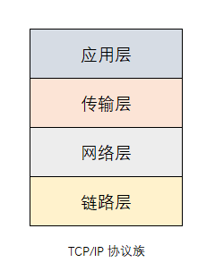
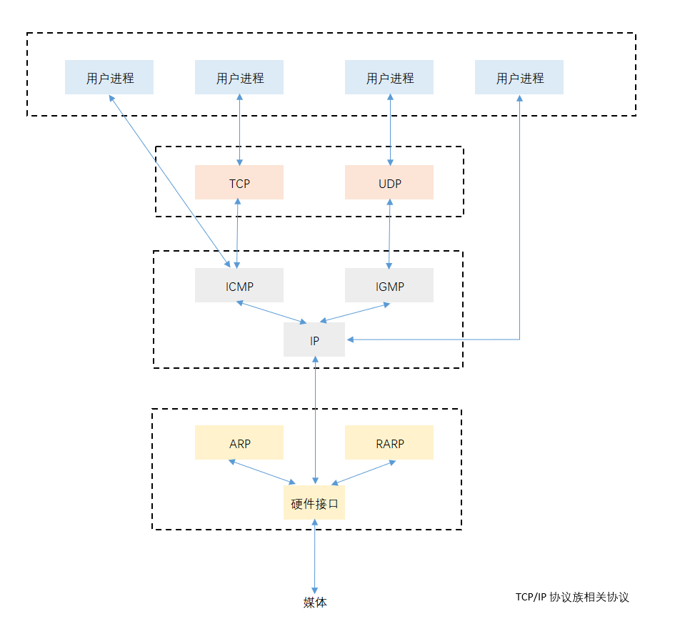
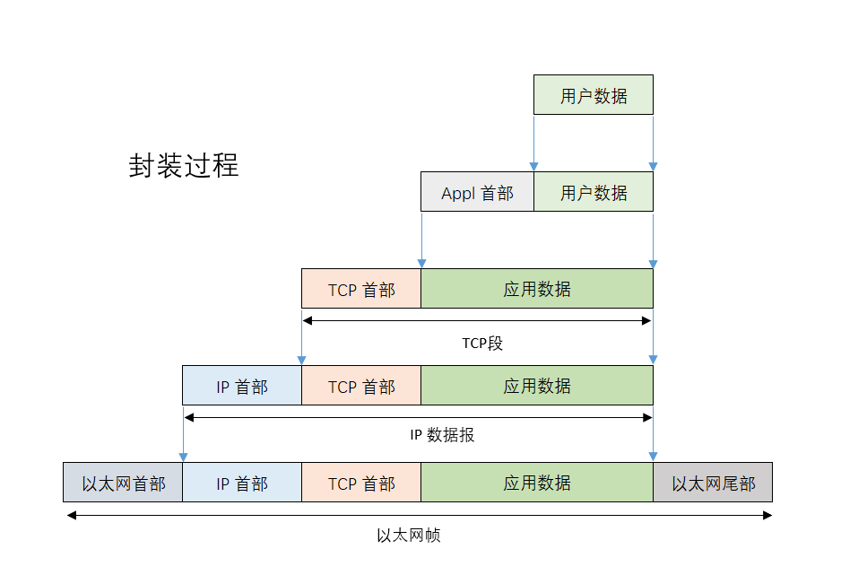
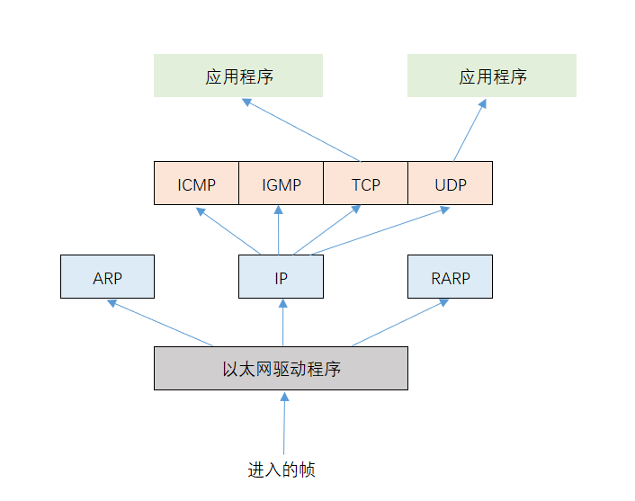

## TCP/IP 详解 卷1：协议

### 第一章 概述

#### 1.1 引言

#### 1.2 分层

- 链路层：有时也称作数据链路层或网络接口层，通常包括操作系统中的设备驱动程序和计算机中对应的网络接口卡。它们一起处理与电缆（或其他任何传输媒介）的物理接口细节。

- 网络层：有时也称作互联网层，处理分组在网络中的活动，例如分组的选路。在 TCP/IP 协议族中，网络层协议包括 IP 协议（网际协议），ICMP 协议（Internet 互联网控制报文协议），以及 IGMP 协议（Internet 组管理协议）。

- 运输层：主要为两台主机上的应用程序提供端到端的通信。在 TCP/IP 协议族中，有两个互不相同的传输协议：TCP（传输控制协议）和 UDP（用户数据报协议）。

- 应用层：负责处理特定的应用程序细节。

#### 1.3 TCP/IP 的分层

#### 1.4 互联网的地址

| 类型 |            范围             |
| :--: | :-------------------------: |
|  A   |  0.0.0.0 - 127.255.255.255  |
|  B   | 128.0.0.0 - 191.255.255.255 |
|  C   | 192.0.0.0 - 223.255.255.255 |
|  D   | 224.0.0.0 - 239.255.255.255 |
|  E   | 240.0.0.0 - 247.255.255.255 |

#### 1.5 域名系统

- 在 TCP/IP 领域中，域名系统（DNS）是一个分布的数据库，由它来提供 IP 地址和主机名之间的映射信息。

#### 1.6 封装

#### 1.7 分用

#### 1.8 客户-服务器模型

- 重复型服务器
  1. 等待一个客户的请求的到来。
  2. 处理客户请求。
  3. 发送响应给发送请求的客户。
  4. 返回第一步。
- 并发型服务器
  1. 等待一个客户请求的到来。
  2. 启动一个新的服务器来处理这个客户的请求。在这期间可能会生成一个新的进程、任务或线程，并依赖操作系统的支持。这个步骤如何进行取决于操作系统。生成的新服务器对客户的全部请求进行处理。处理结束后，终止这个新服务器。
  3. 返回第一步。
- 一般来说，TCP 服务器是并发的，而 UDP 服务器是重复的，但也存在一些例外。

#### 1.9 端口号

#### 1.10 标准化过程

- 四个小组
  1. Internet 协会（ISOC，Internet Society）
  2. Internet 体系结构委员会（IAB，Internet Architecture Board）
  3. Internet 工程专门小组（IETF，Internet Engineering Task Force）
  4. Internet 研究专门小组（IRIF，Internet Research Task Force）

#### 1.11 RFC

#### 1.12 标准的简单服务

#### 1.13 互联网

- internet 这个词的第一个字母是否大写决定了它具有不同的含义。internet 意思是用一个共同的协议族把多个网络连接在一起，而 Internet指的是世界范围内通过 TCP/IP 互联通信的所有主机集合。Internet 是一个 internet，而 internet 不等于 Internet。

#### 1.14 实现

#### 1.15 应用编程接口

#### 1.16 测试网络

#### 1.17 小结

- TCP/IP 协议族分为四层：链路层、网络层、运输层和应用层，每一层各有不同的责任。在 TCP/IP 中，网络层和运输层之间的区别是最为关键的：网络层（IP）提供点到点的服务，而运输层（TCP 和 UDP）提供端到端的服务。
- 一个互联网是网络的网络，构造互联网的共同基石是路由器，它们在 IP 层把网络连在一起。第一个字母大写的 Internet 是指分布在世界各地的大型互联网，其中包括 1 万多个网络和超过 100 万台主机。
- 在一个互联网上，每个接口都用 IP 地址来标识，尽管用户习惯使用主机名而不是 IP 地址。域名系统为主机名和 IP 地址之间提供动态的映射。端口号用来标识互相通信的应用程序。服务器使用知名端口号，而客户使用临时设定的端口号。